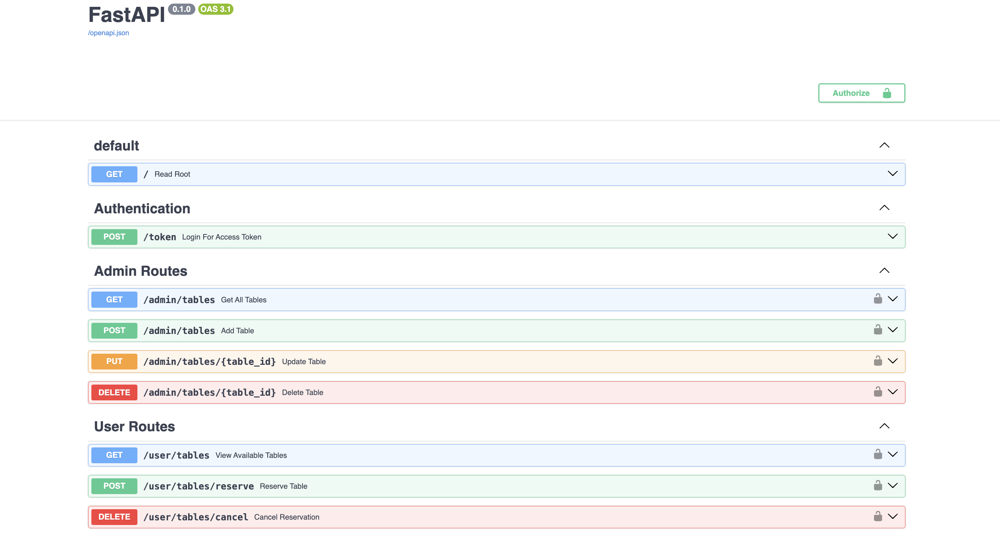

# Table Reservation System - FastAPI

This project is a backend implementation of a simple table reservation system using FastAPI and SQLite. It allows users to reserve tables in a restaurant and includes role-based access control for admins and users.

## Project Overview

The core of the project is built using FastAPI, which provides a fast and easy way to build APIs. The database interaction is managed using SQLAlchemy, and data validation is handled by Pydantic models. The authentication is done using JWT tokens, ensuring that only authenticated users can access the reservation system.

## Key Components

- **Database**: The database is SQLite, with in-memory storage used for testing purposes. SQLAlchemy models define the structure of the data, including tables for users and reservations.
- **Authentication**: Users can authenticate using JWT tokens. Admins can manage table data, while users can only view and reserve available tables.
- **Models**: The `User` model handles user data, including usernames, passwords (hashed with bcrypt), and roles (admin/user). The `Table` model tracks table availability and reservation status.
- **Testing**: Tests are written using `pytest` and FastAPI’s `TestClient`. The test setup includes creating tables and inserting test data into a temporary in-memory database, ensuring no data persistence between tests.

## Routes

### User Routes:
- **View Available Tables**  
  `GET /tables`

- **Reserve a Table**  
  `POST /tables/reserve`

- **Cancel Reservation**  
  `DELETE /tables/cancel`

### Admin Routes:
- **View All Tables**  
  `GET /admin/tables`

- **Add a New Table**  
  `POST /admin/tables`

- **Update Table Details**  
  `PUT /admin/tables/{table_id}`

- **Delete a Table**  
  `DELETE /admin/tables/{table_id}`

### Authentication Route:
- **Login and Get Token**  
  `POST /token`
  
## Project Flow

1. On application startup, the database tables are created using SQLAlchemy’s `Base.metadata.create_all`.
2. Users can register, authenticate, and obtain JWT tokens.
3. Admins have access to add, modify, and remove tables, while users can reserve available tables.
4. Testing is done in an isolated environment using an in-memory database to ensure clean tests and prevent side effects.

This project is designed to demonstrate a simple and clean structure for backend APIs, focusing on JWT authentication, CRUD operations, and database interactions with FastAPI.

